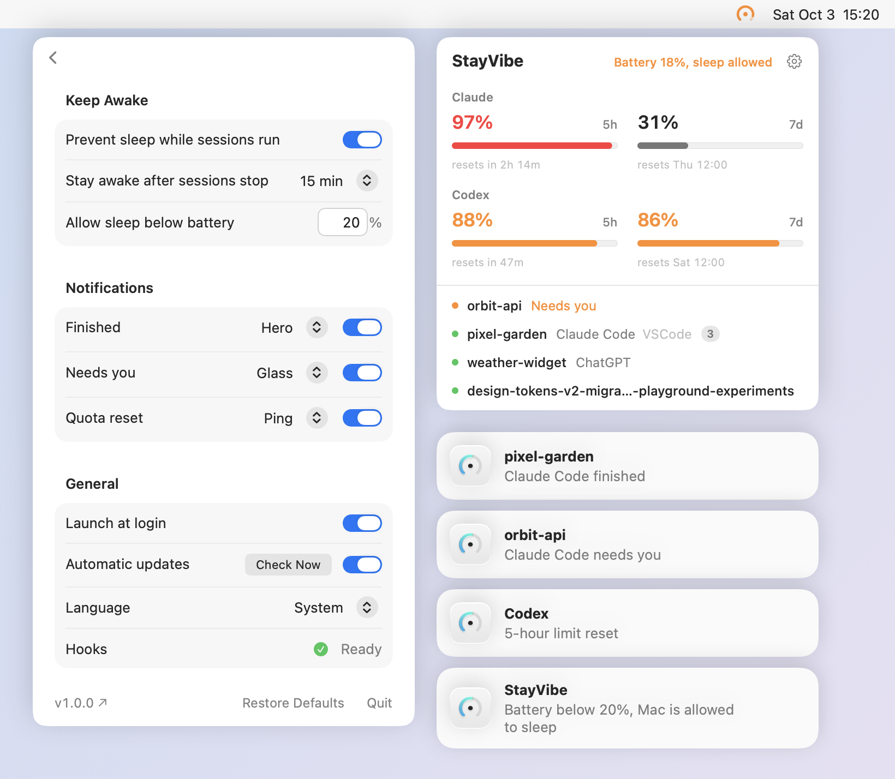

# StayVibe

[简体中文](README.zh-CN.md)



- Keeps your Mac awake while an agent works and for a while after, even with the lid closed, so you can reply from your phone.
- Notifies you when a task finishes, needs you, or a limit resets.
- Shows your Claude and Codex usage (paid plans).
- Works in VS Code, the Claude and ChatGPT apps, and the terminal.

## Install and use

1. Download the DMG from [Releases](https://github.com/dvdsanyi/StayVibe/releases/latest) and drag StayVibe into Applications. Requires macOS 27.
2. Open it. The first time, macOS blocks it because it isn't notarized: go to System Settings → Privacy & Security and click **Open Anyway**.
3. Follow the welcome window.
4. In ChatGPT, or the Codex panel in VS Code, click the hook icon next to the message box and choose **Trust all**.

StayVibe updates itself. To uninstall, quit it and move it to the Trash.

## Build (for developers only)

```sh
git clone https://github.com/dvdsanyi/StayVibe.git
cd StayVibe
scripts/build.sh --install   # needs Xcode 27
```
