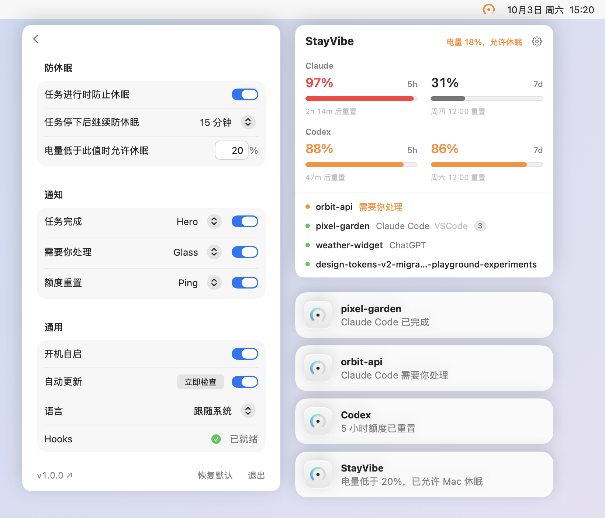

# StayVibe

[English](README.md)



- agent 工作时及停下后一段时间内让 Mac 保持运行，合上盖子也不睡，方便用手机继续回复。
- 任务完成、需要你处理、额度重置时通知你。
- 显示 Claude 和 Codex 的额度（付费套餐）。
- 支持 VS Code、Claude、ChatGPT 和终端。

## 安装和使用

1. 从 [Releases](https://github.com/dvdsanyi/StayVibe/releases/latest) 下载 DMG，把 StayVibe 拖进「应用程序」。需要 macOS 27。
2. 打开它。第一次会被 macOS 拦下，因为还没经过 Apple 公证：到「系统设置 → 隐私与安全性」点「仍要打开」。
3. 按欢迎窗口的步骤操作。
4. 在 ChatGPT 或 VS Code 的 Codex 面板里，点输入框旁的钩子图标，选「Trust all」。

StayVibe 会自动更新。卸载时，退出后把它拖进废纸篓即可。

## 从源码构建（仅供开发者）

```sh
git clone https://github.com/dvdsanyi/StayVibe.git
cd StayVibe
scripts/build.sh --install   # 需要 Xcode 27
```
